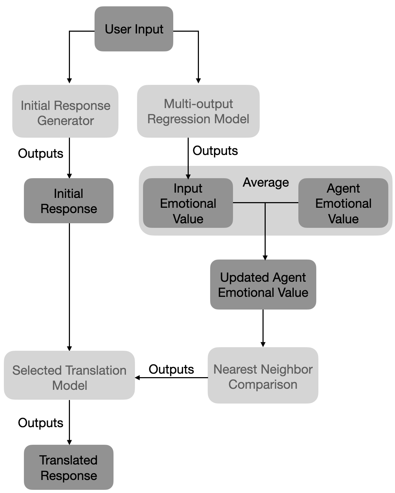

# Emotionally Aligned Responses through Translation
> **Abstract:** Emotional response generation is an area of particular interest within conversational AI. However, many approaches encounter a lack of control over the response which could be due in part to the widely adopted approach of reflecting the users emotion in the response. As such this paper proposes an independently maintained emotion for the conversational agent through the use of Valence, Arousal, and Dominance scores, which are updated based on user input. Additionally, by treating the alignment of the response as a matter of translation, a set of fine tuned sequence to sequence models are used to translate an initially generated response into one aligned with the agent emotion. This work provides a unique perspective on the topic of emotional response generation and showcases that potential means for improved consistency and controlability may yet be discovered beyond traditional methods.

### Framework Overview

### Dependencies
`pandas 2.2.2`
`numpy 1.26.4`
`scikit-learn 1.5.0`
`evaluate 0.4.2`
`datasets 2.19.2`
`transformers 4.41.2`
`rouge-score`

### Data 
1. EmoBank   |  [**link**](https://github.com/JULIELab/EmoBank/tree/master/corpus) |
2. NRC VAD Lexicon   |    [**link**](https://saifmohammad.com/WebPages/nrc-vad.html)    |
3. EmpatheticDialogues |     [**link**](https://huggingface.co/datasets/facebook/empathetic_dialogues)   |
4.   Emotion Dataset  |           [**link**](https://huggingface.co/datasets/dair-ai/emotion)             |
5.   dialogsum  |  [**link**](https://huggingface.co/datasets/knkarthick/dialogsum)             |

### Running Evaluation
In the translate.py file, there are a number of function calls at the bottom, run each to do the following
runModelInit()  Trains and fine tunes new versions of the models, this is necessary to run first as the models are too large to add to the repository.
`r = Runtime()`   Create a new runtime  
`r.runText()`     Runs each of the models for comparison against a selected text  
`r.evalBB()`      Runs the BlenderBot model against the evaluation text  
`r.eval()`        Runs ETC Against the evaluation text  
`r.evalUntuned()` Runs The untuned seq2seq against the evaluation text  
`evalMetrics()`   Evaluates the predictions from each model against the evaluation responses  

### Generated Files
"data/replyEvalSet.tsv" Target Evaluation responses
"data/evalTranslate.tsv" ETC Evaluation responses
"data/evaluntuned.tsv" Untuned evaluation responses
"data/evalbb.tsv" BlenderBot evaluation responses
"data/evalutterances.tsv" Evaluation set utterances (not used, but a sanity check)
"data/evalResText.tsv" Model responses to a specific text
"data/evalResTextEmos.tsv" Predicted VAD scores for "data/evalResText.tsv"
### License
This project is distributed under CC BY-SA 4.0
https://creativecommons.org/licenses/by-sa/4.0/
